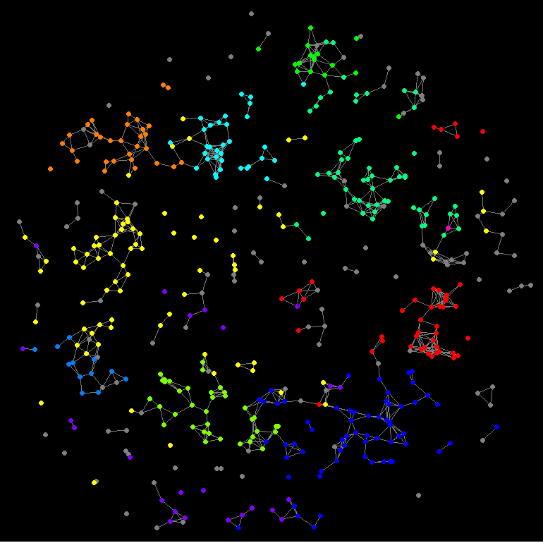

nurep
=====

A very basic replay viewer for completed planets.nu games. It downloads turn information for each player in order to build complete knowledge of the cluster, and then it displays the changing ownership of the planets as the game progresses.

## Usage

* Downloading game information from planets.nu is a prerequisite step and is done using the `nurep-download` tool. This is a command-line utility whose usage is `nurep-download <GAME_ID> <OUTPUT_PATH>`, where `<GAME_ID>` is the ID of a completed planets.nu game and `<OUTPUT_PATH>` is the path of the file in which game data should be saved. Downloading information for an entire game can take several minutes, so it's convenient to be able to save this to a file so that it can be replayed repeatedly.
  * The ID of a game can be found in the URL at which the game is accessed. For example, if the URL of the game's player list is `http://planets.nu/#/sector/815/players`, the game ID is `815`.
  * Example: `nurep-download 103530 ./test.json`
* Run the replay using `nurep <INPUT_PATH>`. It will play the game at a speed of two turns per second until the game is over. You can exit at any time using the ESC key.
  * Example: `nurep ./test.json`
